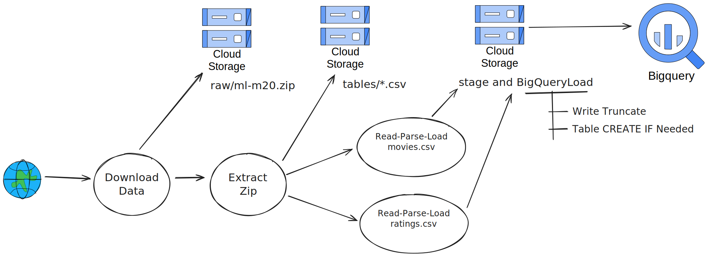

# Setup

## 1. Give Permission to Execute Shell Scripts

Assuming you are on a Linux or Unix-based system, give permission to the sbin folder to execute the shell scripts:

```bash
chmod +x sbin/*.sh
```

## 2. Permissions and Steps to Run the Script

### Service Account Creation

- `iam.serviceAccounts.create` and `iam.serviceAccounts.get` on the project level.
- `iam.serviceAccountKeys.create` on the service account.

### Role Assignment

- `resourcemanager.projects.setIamPolicy` on the project level to assign roles to the service account.

### JSON Key Creation

- `iam.serviceAccountKeys.create` on the service account level.

### Setting Default Project

- `resourcemanager.projects.get` on the project level to set the default project using `gcloud config set project`.

### Before Running the Script

1. Authenticate with Google Cloud:

   ```bash
   gcloud auth login
   ```

2. Set the Default Project:

   ```bash
   gcloud config set project your-project-id
   ```

   Replace `your-project-id` with your actual project ID.

3. Grant Permissions:

   Ensure that your account has the necessary permissions to create service accounts, assign roles, and create service account keys on the specified project.

### Run the Script

After performing the above steps, you can execute your script:

```bash
./sbin/create-service-account.sh --project-id "your-project-id"
```

This will create a `service-account` folder with the key file through which we will be applying the Terraform plan. Make sure to replace `"your-project-id"` with the actual project ID you want to use in the script.

## 3. Run Terraform:
Prerequisite [Install Terraform](https://developer.hashicorp.com/terraform/tutorials/aws-get-started/install-cli#install-terraform)
- Initialize the project
    ```bash
    terraform -chdir=terraform-project init
    ```
- Apply the plan
    ```bash
    terraform -chdir=terraform-project apply
    ```
**Note:** This step will create a GCS bucket, Artifact Registry and BigQuery Dataset in us-central1 region.

# DataFlow Pipeline

Executing these actions will construct and upload the flex template to the artifact registry, initiating the execution of the DataFlow Job.

## 4. Build DataFlow Flex Template
Before Running below commands change the project_id in Makefile

```bash
make template
```

## 5. Run DataFlow Job
```bash
make run
```
# Deliverables

   - ### **Source code for the Dataflow pipeline and any associated scripts.**
      Source Code for Dataflow pipeline can be found under [waltlabs_movielens](waltlabs_movielens) folder.
   - ### **A diagram showing the flow of data through various GCP services**

      
   - ### **Documentation explaining the pipeline design, choice of GCP services, and rationale behind key decisions.**
      The Document can be found [here](public/key-decisions.md)

# Demo Video on Implementation
[Demo Video](public/Waltlabs-Movielens.mp4)